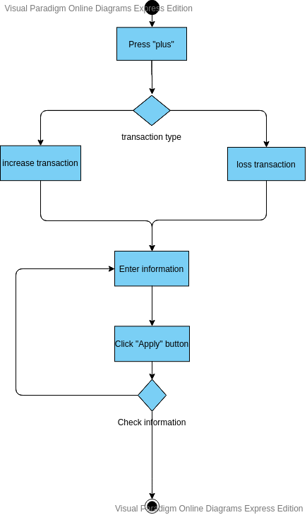
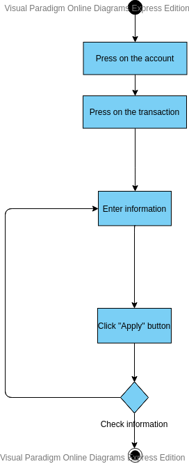
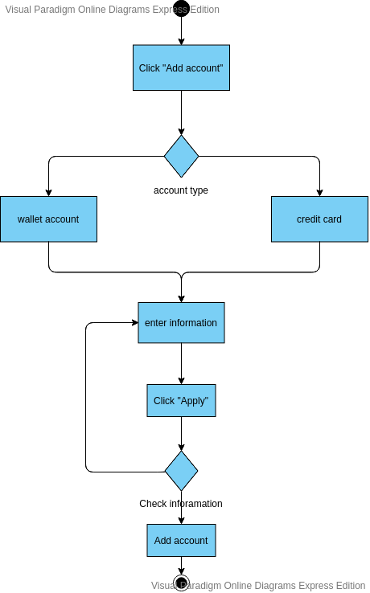

# UML Diagrams

## Содержание

1. [Диаграмма прецедентов](#precedent_diagramm)  
1.1 [Актёры](#actors)  
1.2 [Варианты использования](#variant_usages)  
1.2.1 [Добавление счета](#add_account)  
1.2.2 [Редактирование счета](#rename_account)  
1.2.3 [Удаление счета](#delete_account)  
1.2.4 [Просмотр детальной информации о транзакциях со счетом](#view_transactions)  
1.2.5 [Удаление транзакции](#delete_transaction)  
1.2.6 [Редактирование транзакции](#refactor_transaction)  
1.2.7 [Добавление транзакции](#add_transaction)  
2. [Диаграммы активностей](#activity_diagramms)  
2.1 [Добавление транзакции](#add_transaction_activity)  
2.2 [Редактирование транзакции](#refactor_transaction_activity)  
2.3 [Добавление счета](#add_account_activity)  
3. [Диаграмма последовательности](#sequence_diagramm)  
4. [Диаграммы состояний](#state_diagramm)  
4.1 [Регистрация](#register_state)  
4.2 [Добавление продукта в корзину](#add_product_state)  
4.3 [Комментирование](#comment_state)  
4.4 [Создание заказа](#create_order_state)  
5. [Диаграмма класов](#classes_diagramm)  
6. [Диаграмма компонентов и развертывания](#mass_diagramm)  

<a name="precedent_diagramm"/>

## 1 Диаграмма прецедентов

<a name="actors"/>

### 1.1 Актёры
| Актёр | Описание |
|:---|:---|
| User | Человек, который использует приложение |

<a name="variant_usages"/>

### 1.2 Варианты использования

<a name="add_account"/>

#### 1.2.1 Поток событий для прецедента "Добавление счета" :
<strong>Описание:</strong> Вариант использования "Добавление счета" позволяет пользователю создать новый счет.  
<strong>Поток событий:</strong>  
1. Пользователь нажимает клавишу с тремя точками на главной панеле вверху.
2. Открывается меню.
3. Пользователь нажимает "Add account".
4. Пользователь выбирает тип счета.
5. Пользователь вводит название счета и начальную сумму на счете.
6. Приложение добавляет счет.
7. Конец.

<a name="rename_account"/>

#### 1.2.2 Поток событий для прецедента "Редактирование счета" :
<strong>Описание:</strong> Вариант использования "Редактирование счета" позволяет редактировать имя и тип счета.  
<strong>Поток событий:</strong>  
1. Пользователь нажимает иконку с карандашом под изображением счета.
2. Появляется диалоговое окно.
3. Пользователь вводит новое имя и, возможно, меняет тип счета.
4. Пользователь подтверждает действие, нажав ОК
5. Приложение обновляет имя и тип счета.
6. Конец.

<a name="delete_account"/>

#### 1.2.3 Поток событий для прецедента "Удаление счета" :
<strong>Описание:</strong> Вариант использования "Удаление счета" позволяет пользователю удалять счет с его транзакциями.  
<strong>Поток событий:</strong>  
1. Пользователь нажимает иконку корзины под изображением счета.
2. Появляется диалоговое окно для подтверждения удаления.
3. Приложение удаляет при подтверждении(нажатии ОК)
4. Приложение удаляет все транзакции, проведенные с этим счетом
4. Конец.

<a name="view_transactions"/>

#### 1.2.4 Поток событий для прецедента "Просмотр детальной информации о транзакциях со счетом"" :
<strong>Описание:</strong> Вариант использования "Просмотр детальной информации о продукте" позволяет пользователю просматривать список транзакций определенного счетв.  
<strong>Поток событий:</strong>  
1. Пользователь нажимает на изображение счета.
2. Приложение переходит на страницу детального просмотра выбранного счета.
3. Пользователь просматривает транзакции счета.
4. Здесь пользователь может редактировать или удалять транзакции
5. Конец.

<a name="delete_transaction"/>

#### 1.2.5 Поток событий для прецедента "Удаление транзакции" :
<strong>Описание:</strong> Вариант использования "Удаление транзакции" позволяет пользователю удалить транзакцию.  
<strong>Поток событий:</strong>  
1. Пользователь свайпает транзакцию влево или вправо.
2. Приложение удаляет транзакцию
3. Снизу временно появляется байда, позволяющая отменить удаление, нажав Undo
4. Конец.
<a name="refactor_transaction"/>

#### 1.2.6 Поток событий для прецедента "Редактирование транзакции" :
<strong>Описание:</strong> Вариант использования "Редактирование транзакции" позволяет пользователю редактировать транзакцию.  
<strong>Поток событий:</strong>  
1. Пользователь нажимает на транзакцию.
2. Появляется окно для редактирования.
3. Пользователь изменяет значение, комментарий и дату.
4. Пользователь подтверждает действие
5. Приложение обновляет информацию о транзакции
6. Конец.

<a name="add_transaction"/>

#### 1.2.7 Поток событий для прецедента "Добавление транзакции" :
<strong>Описание:</strong> Вариант использования "Добавление транзакции" позволяет пользователю добавить транзакцию.  
<strong>Поток событий:</strong>  
1. Пользователь нажимает на круглую кнопку с плюсом внизу и среди появившихся двух выбирает тип транзакции: затрату или прибавку
2. Снизу появляется полуокно для ввода информации о транзакции
3. Пользователь выбирает категорию, вводит значение и, возможно, комментарий к транзакции.
4. Пользователь подтверждает действие, нажав ОК.
5. Конец.

<a name="activity_diagramms"/>

## 2 Диаграммы активностей

<a name="add_transaction_activity"/>

### 2.1 Добавление транзакции
Пользователь нажимает плюсик и выбирает тип транзакции - прибавка или трата. Затем в появившемся окне выбирает категорию из предложенных, вводит сумму, и необязательный комментарий. В случае корректного ввода и выбора транзакции транзакция добавляется в список транзакции счета.

<a name="refactor_transaction_activity"/>

### 2.2 Редактирование транзакции
Пользователь нажимает на счет. Сменяется вид на список транзакций этого аккаунта. Пользователь нажимает на интересуемую транзакцию. В появившемся окне, возможно, вводит комментарий, меняет сумму и дату транзакции. При корректном вводе и подтверждении информация о транзакции обновляется

<a name="add_account_activity"/>

### 2.3 Добавление счета
Пользователь в верхнем меню нажимает "Add account", затем, определившись с типом аккаунта, - "add wallet" или "add credit card". В появившемся окне, пользователь выбирает имя и вводит начальную сумму на счете. При корректном вводе и подтверждении приложение добавляет счет с суммой на нем.

<a name="sequence_diagramm"/>

## 3 Диаграмма последовательности
Диаграмма последовательности основных вариантов использования представлена ниже:

<a name="state_diagramm"/>

## 4 Диаграммы состояний

<a name="register_state"/>

### 4.1 Регистрация

<a name="add_product_state"/>

### 4.2 Добавление продукта в корзину
Окно добавления продукта в корзину: https://github.com/KirillBelitsky/Cafe/blob/master/Documents/Mockups/mockup_breakfastNew.PNG

<a name="comment_state"/>

### 4.3 Комментирование
Пример окна с возможностью комментирования: https://github.com/KirillBelitsky/Cafe/blob/master/Documents/Mockups/mockup_dishUpdate.PNG

<a name="create_order_state"/>

### 4.4 Создание заказа
Пример окна с создание заказа: https://github.com/KirillBelitsky/Cafe/blob/master/Documents/Mockups/mockup_basket.PNG

<a name="classes_diagramm"/>

## 5 Диаграмма классов

Схемы диаграммы классов разделена на уровни:
+ Dto level - классы-сущности, которые используются при взаимодействии контроллеров и фронтенда.
+ Model level - сущности, представляемые таблицу в базе данных.
+ Repository level - классы для взаимодествия с базой данных.
+ Service level - классы, содержащие в себе всю бизнес-логику приложения.
+ Controller level - классы, предназначенные для принятия и отправления http запроса фронтенду.

<a name="mass_diagramm"/>

## 6 Диаграмма компонентов и развертывания

