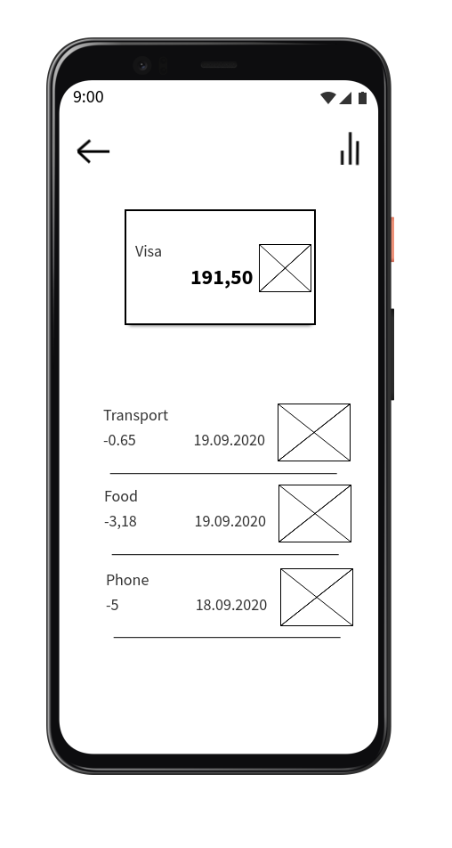

# Требования к проекту

## Содержание

1. [Введение](#intro)  
1.1. [Назначение](#purpose)  
1.2. [Бизнес-требования](#business_req)  
1.2.1 [Исходные данные](#source_data)  
1.2.2 [Границы проекта](#project_scopes)  
2. [Требования пользователя](#user_requirements) 
2.1 [Программные интерфейсы](#program_interfaces) 
2.2 [Интерфейс пользователя](#user_interface)  
2.3 [Характеристика пользователя](#charact_users)  
2.3.1 [Аудитория приложения](#audit_app)  
3. [Системные требования](#system_requirements)  
3.1. [Функциональные требования](#functional_requirements)  
3.2. [Нефункциональные требования](#nonfunctional_requirements)  
3.2.1 [Атрибуты качества](#attr_quality)  
3.2.1.1 [Требования к удобству использования](#requir_convenience_usages)  
3.2.1.2 [Требования к безопасности](#requir_security)  
3.2.2 [Ограничения](#restrictions)  

## Глоссарий

<a name="intro"/>

## 1 Введение

<a name="purpose"/>

## 1.1 Назначение
BudgetFy будет разработан для пользоваелей android-устройств и предназначен
для учета финансов и оценки затрат

<a name="business_req"/>

## 1.2 Бизнес-требования

<a name="source_data"/>

#### 1.2.1 Исходные данные
Ни одна страна не застрахована от кризиса. И тяжелые финансовые положения
так или иначе сказываются и на обычных граждан. В такое время людям не
позволительно разбрасываться деньгами. Чтобы в конце месяца не заглядывать
в кошелек со вздохом и не уходить от банкомата с грустным лицом
необходимо, чтобы человек наглядно видел, на что он потратил свои деньги.
Чтобы решить эту проблему (наглядность расходов) разработано это приложение.

<a name="project_scopes"/>

#### 1.2.2 Границы проекта
Пользователи смогут создавать счета с начальной суммой. Они смогут добавлять
операции со счетами: добавление суммы, трата суммы. Каждая операция
либо добавляет, либо отнимает сумму со счета, в зависимости от категории.
Также пользователь будет иметь возможность видеть в процентном соотношении
колличество потраченных денег по категориям

<a name="user_requirements"/>

## 2 Требования пользователя

<a name="program_interfaces"/>

### 2.1 Программные интерфейсы
Язык программирования - Java (jdk 8)
Среда разработки - Android Studio 4.0.2 for Windows 64-bit
Проект будет написан на языке программирования Java для платформы Android

<a name="user_interface"/>

### 2.2 Пользовательский интерфейс
* Стартовое окно 

* Страница определенного счета 

* Страница добавления транзакции 

<a name="charact_users"/>

### 2.3 Характеристика пользователей

<a name="audit_app">

#### 2.3.1 Аудитория приложения
Люди, которые хотят сэкономить или просто проанализировать свои расходы.

<a name="system_requirements"/>

## 3 Системные требования

<a name="functional_requirements">

### 3.1 Функциональные требования
Пользователю предоставлены возможности:
| Функция | Требования |
| :--- | :--- |
| Добавление счета | Пользователь должен иметь возможность добавлять счет в систему с начальной суммой. |
| Удаление счета | Пользователь должен иметь возможность удалить свой счет, при необходимости. В таком случае удаляются и транзакции, произведенные с этим счетом. |
| Добавление транзакции | Пользователь должен иметь возможность добавлять транзакцию: прибавку или трату по отношению к конкретному счету. |
| Удаление транзакции | Пользователь должен иметь возможность удалять добавленную транзакцию, при необходимости. |
| Просмотр транзакций | Пользователь должен иметь возможность просматривать транзакции, произведенные с определенным счетом. |
| Просмотр статистики | Пользователь должен иметь возможность просматривать статистику в процентном отнешении по категориям транзакций, произведенными над счетом. |

<a name="nonfunctional_requirements"/>

### 3.2 Нефункциональные требования

<a name="attr_quality">

#### 3.2.1 Аттрибуты качества

Важными атрибутами являются высокая производительность, малое потребление ресурсов, отсутствие рекламы, защищённость пользовательских данных.

<a name="requir_convenience_usages"/>

##### 3.2.1.1 Требования к удобству использования
* Приложение должно правильно отображаться на устройствах с разными разрешением экрана и плотностью пикселей
* Все функциональные элементы должны хорошо различаться в цветовой гамме

<a name="restrictions">

#### 3.2.2 Ограничения
* Приложение реализовано на языке Java для платформы Android

# 4 Аналоги
Аналогами являются [1Money](https://play.google.com/store/apps/details?id=org.pixelrush.moneyiq&hl=ru) и [Monefy](https://play.google.com/store/apps/details?id=com.monefy.app.lite&hl=ru).